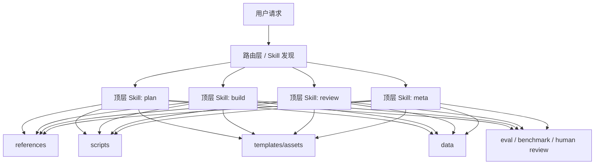
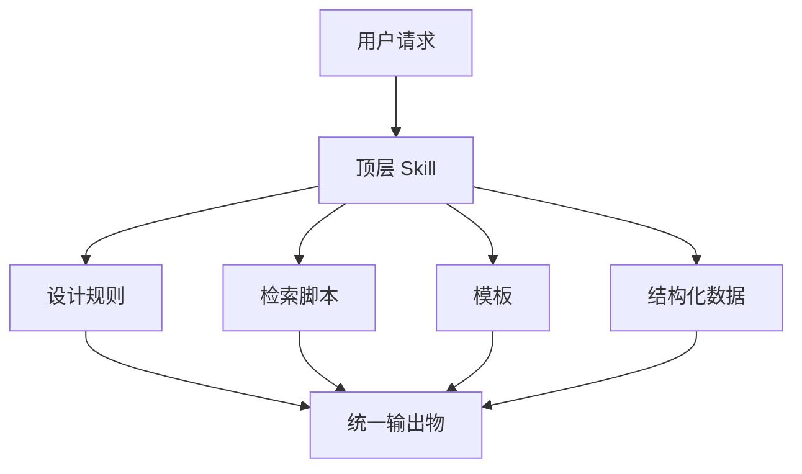
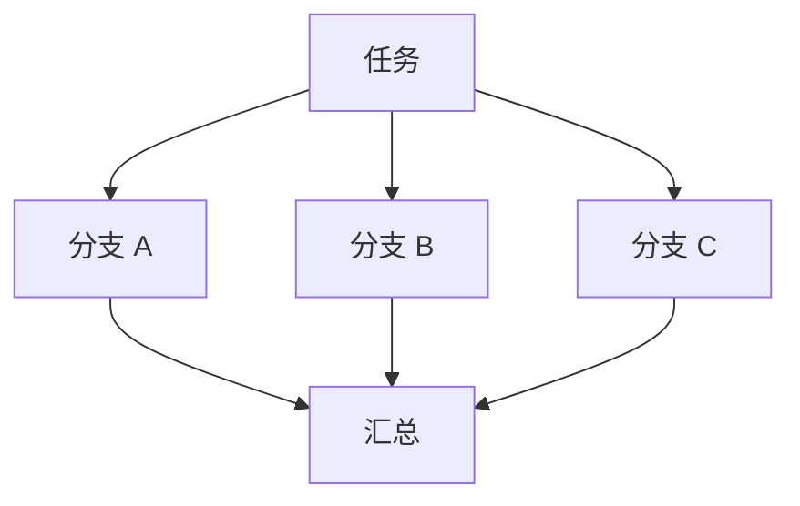

# Skills 架构说明

## 1. 架构目标

本架构说明回答的是：

- skill 系统在仓库里应该如何组织
- 顶层 skill 与底层能力层如何分工
- 多 skill 如何协作
- 为什么“少量顶层 skill + 深层资源系统”比“平铺大量微技能”更稳

## 2. 推荐总架构

## 2.1 分层架构



这个架构有两个重点：

- 顶层 skill 负责“让模型选”
- 底层资源层负责“让系统做深”

## 2.2 为什么这样分层

如果把所有能力都平铺为 skill：

- 路由面会过大
- description 会相互重叠
- 模型更难选
- 评估更难做

如果把所有能力都塞进一个巨大 skill：

- `SKILL.md` 会膨胀
- 边界会失真
- 工作流会混乱
- review 与 build 逻辑会互相污染

因此合理架构必须分层。

## 3. 顶层 skill 架构

## 3.1 默认四技能架构


这不是固定执行顺序，而是默认职责划分：

- `plan`: 需求收集、澄清、切 scope、产出方案
- `build`: 主体生成、执行、实现
- `review`: QA、critique、benchmark、验证
- `meta`: skill 自身维护、打包、调优、演进

### 适用场景

- 新系统
- 团队内部技能平台
- 中大型插件市场
- 多个 skill 需要长期维护

## 3.2 单技能架构

有些系统不需要四技能，只需要一个顶层 skill。

适用条件：

- 用户任务高度集中
- 输出物家族统一
- 工作流边界稳定

`ui-ux-pro-max-skill` 就接近这种情况：

- 对外看是一个 UI/UX 设计系统工作流 skill
- 对内有很多 domain assets

### 架构图



这个架构下，skill 可以很强，但前提是：

- 它只服务一个统一工作流
- 它的内部资源是模块化的

## 4. 底层能力层架构

## 4.1 references 层

职责：

- 承载长文本知识
- 按需加载
- 按领域切分

典型内容：

- domain guide
- review checklist
- style guide
- schema explanation

### 设计要求

- 不要嵌套太深
- 大文件要有目录
- 目录应围绕子领域，而不是围绕随意命名

## 4.2 scripts 层

职责：

- 把确定性、重复性、高风险步骤外移

典型内容：

- validate
- package
- search
- transform
- render

### 设计要求

- 参数尽量平坦
- 输入输出明确
- 文档里写清楚何时该调用 script

## 4.3 templates / assets 层

职责：

- 承载输出结构
- 提供 starter artifacts

典型内容：

- markdown template
- HTML shell
- design tokens
- starter JSON

## 4.4 data 层

职责：

- 承载结构化知识

典型内容：

- CSV
- JSON
- taxonomy
- scoring rules

这是 `ui-ux-pro-max-skill` 特别重要的一层。它的很多能力，本质上就是“结构化知识 + 脚本查询”的结果。

## 5. 工作流编排架构

## 5.1 线性工作流

适合：

- 固定步骤
- 阶段性依赖明确


常见于：

- 文档生成
- 代码生成
- skill packaging

## 5.2 并行收集 + 汇总

适合：

- 多源检索
- 多域独立信息收集



这类模式在 research 类、UI recommendation 类 skill 里特别有效。

## 5.3 生成-评审闭环

适合：

- 文案
- 设计
- 报告
- 复杂计划


这是 Google ADK 文档里明确支持的模式，也非常适合 skill 内部 workflow。

## 6. 仓库组织架构

推荐如下：

```text
project/
|-- skill-registry/              # 顶层 skill 注册或插件描述
|-- skills/
|   |-- plan/
|   |   |-- SKILL.md
|   |   |-- references/
|   |   `-- evals/
|   |-- build/
|   |   |-- SKILL.md
|   |   |-- scripts/
|   |   |-- templates/
|   |   `-- evals/
|   |-- review/
|   |   |-- SKILL.md
|   |   |-- references/
|   |   |-- scripts/
|   |   `-- evals/
|   `-- meta/
|       |-- SKILL.md
|       |-- scripts/
|       `-- evals/
|-- shared/
|   |-- data/
|   |-- templates/
|   `-- references/
`-- docs/
```

### 核心原则

- 顶层 skill 数量少
- 公共资源不要复制粘贴到每个 skill
- source of truth 只能有一份
- 安装副本和分发副本应由 source of truth 生成

## 7. `ui-ux-pro-max-skill` 的架构启示

它给出的启示有三条：

### 启示 1：source of truth 与分发副本分离

这能解决：

- 多平台安装
- 本地开发
- CLI 打包
- 版本同步

### 启示 2：顶层 skill 可以宽，但底层必须深度模块化

没有底层 CSV、scripts、templates 的支撑，宽 skill 很容易退化成“说得很多，做得很浅”。

### 启示 3：统一输出物比统一知识域更重要

它能成立，不是因为所有知识都跟“设计”相关，而是因为它们最终都汇聚到：

- 设计系统推荐
- UI 实现建议
- UI review 结果

## 8. `skill-creator` 的架构启示

它给出的启示有三条：

### 启示 1：skill 平台必须有 meta 层

如果没有 meta 层，skill 只会越堆越多，没人知道如何评估、优化和发布。

### 启示 2：eval 是架构的一部分

不是“做完再测”，而是架构中一开始就存在：

- inputs
- expected output
- assertions
- benchmark
- human feedback

### 启示 3：description 是路由层资产

它不是文案，而是 skill discovery 的第一入口。

## 9. 最终推荐架构

综合样本和外部资料，我建议最终采用：

### 对外

- 少量顶层 workflow skill

### 对内

- `references`
- `scripts`
- `templates/assets`
- `data`
- `evals`

### 运行时

- progressive disclosure
- workflow orchestration
- review / benchmark loop

### 维护上

- source of truth
- packaging
- trigger tuning
- baseline comparison

## 10. 一句话架构结论

> 一个成熟的 skill 系统，本质上不是“技能集合”，而是“少量工作流入口 + 深层能力资源层 + 持续评估闭环”的三层系统。
